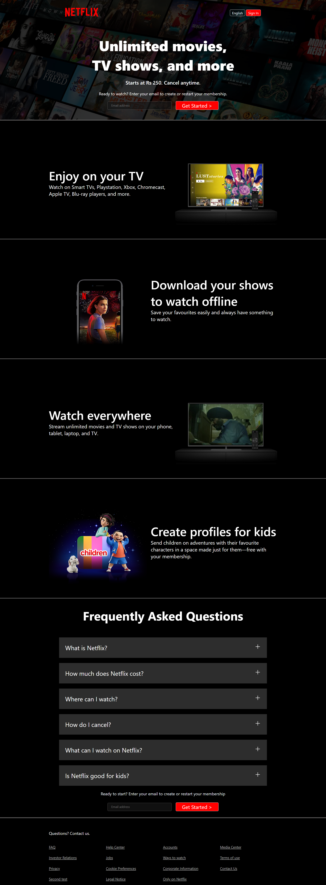

# 🎬 Netflix Clone (HTML + CSS)

This is a simple **Netflix landing page clone** built using **HTML and CSS** only.  
It replicates the look and feel of Netflix's homepage with sections like hero banner, feature highlights, FAQ, and footer.

---

## 🚀 Features
- Responsive **Netflix-like landing page**
- Hero section with background overlay and call-to-action
- Multiple feature sections:
  - Watch on your TV
  - Download shows for offline viewing
  - Watch everywhere (mobile, tablet, laptop, TV)
  - Kids profiles
- FAQ section styled like Netflix
- Footer with multiple navigation links

---

## 🛠️ Technologies Used
- **HTML5**
- **CSS3**

---

## 📸 Preview

---

📌 Future Improvements

- Add JavaScript for FAQ toggle animations
- Connect to database

🙌 Acknowledgements

- This project was inspired by Netflix's official homepage.
- Built for learning purposes (non-commercial)
- Improve styling to fully match Netflix

## Author

- HAMNA NAZAR